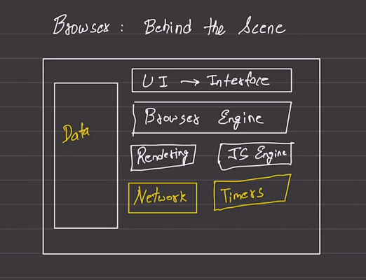
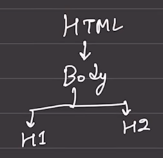

Browser

Rendering part

HTML --> C++

job for the browsesr is
    Display
    Interact

Any engine load file Raw bytes format
give the browser to charater (utf) sequence -> tokenize -> h1, P, html

converts to Object
h1{
    tag:h1
    value:sh
}
p{

}

html is a Documant

convert those objects into a structure is called Model

Establish relation
    nodes are generated 
    -> Node List

    create a DOM

CSS Raw->Charater->token->Object->relation->Model
    CSSOM

DOM and CSSDOM independent

Render Tree
    gathers info DOM and CSSDOM given to browser engines 

Painting 
    web page rendering on the browser

Bowser sees Script tag it will stops excecuting DOM and collect all the info from JS

HTML css should reach to the browser first

when Bowser sees CSSOM 
    JS excecution will be halted untill CSSOM is ready