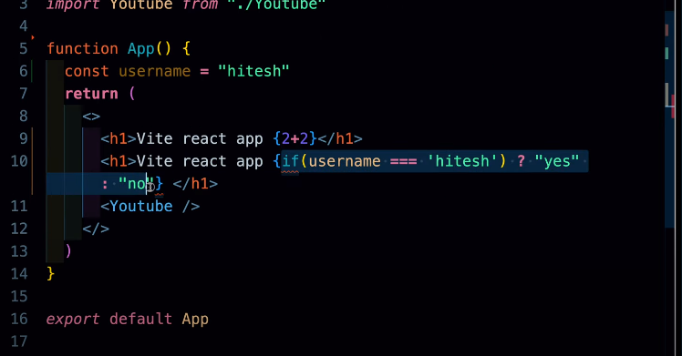

why React
    easy to manage & build complex front end

react used to build consistancy in the UI   b/w JS and DOM

React is consisting way to update DOM element.

Framework strict rules
Library no rules

Hooks
component

Additional ad ons to react
    Router
    Redux
    class based

md means mark down syntax

readme.md
git init
git add .
git commit -m 'start'
git branch -M main
git remaote add origin 
git push

vite , Parcel are bundlers
npx execute

by create-react-app

or npm create vite@latest

web-vitals i for performance web
react-scripts used by CRA perform all heavy lifting such as module bundling
                so you dont want to manage webpack file 

CRA
    not ask for testing library dependencies etc
    web-vitals to check performances of app
    ejct eject complete react app from config
    build gives production version in (html js css)
    public
        robots.txt ->  for google indexing
        manifest.json -> mobile icons indexing
    react-scripts inject scripts into index.html

vite
    dependency only react react-dom tahts it
    should be jsx to the file name extension
    file name component capital is not mandatory
    only function name an import is mandatory for JSX component 

this type of declaration does not work only evaluation works {2+2}

Why we need hooks
  state : any change in the state rerenders the UI in the webpage  

    multiple state batching the setCounter

Reconciliation
    diffing the virtual DOM tree with the updated virtual DOM to determine the most efficient way to update the real DOM.

The reconciler does the work of computing which parts of tree have changed;
The renderer then user that info to actual update the rendered app.

Fiber
    lightWeight units of work represents indiviadual components or elements in component tree.
    The fibre data structure allows React to pause,abort,and prioritize different parts of the rendering process.

useCallback is a React hook that lets you cache a function definition between re-renders
used to performance optimization

useId generates unique ids

Routers
    
