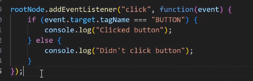

built by facebook
source code https://github.com/facebook/react
React is just other people's javascript code

-> The Dom and Declaraive programming
Document Object Model
    
     
    html being converted to DOM by bowser and serves to user view

Dom Manipulation (browser Re-rendering)
    Change the DOM tree browser gets rerenders.

docment.getelementById('') is browser API not a jS standard,
setTimeout  is browser API not a jS standard

    Imperative Programming
        A style of programming in which you describe how a program should accomplish a task. 
        ex: counter increment 
    Declarative 
        A style of programming in which you describe what you want the program to accomplish without describing how.
        ex: 
        focus only the logic
    
React used Declarative 

Recursion
    A function calling itself

React DOM updates

Components -> in react everything is a component

Pure Functions

examples

Props -> object that contains any of the information we want to be passes to the  function.
 In ReactJS, the props are a type of object where the value of attributes of a tag is stored. The word “props” implies “properties”, and its working functionality is quite similar to HTML attributes. Basically, these props components are read-only components.

Props are imutability unable to change
becoz props are frozen by react
If the object being passes to the function is immutable then that funcion is pure.

className is browser api's thing

Transpiler convert JSX xml to react createElement
Babel is used to to transpile

JSX is an XML-like syntax extension to ECMAScript. without any defined semantics. ex-> <Counter/>
is a javascript syntax extension
is a javascriipt xml

Authorig html -> use Fragment instead of using div bcoz deeped tree will slow down css

Fiber and Reconciliation
Fiber tree
    simple objects used by react's code to store info and determine what work needs to be done. its not recreated it will be updated
    ex: siblings , children

Reconciliation
    Comparing two items to find differences between them.
Tree Reconciliation
    comparing two trees/ portions of trees and finding the steps needed to make them match
Tree edit distance problem
    what is the algorithm to find the smallest number of steps to change one tree to match another?

Fiber tree works in progress node

Reconciliation Algorithm

Removeing ul and add new ul
   fiberNode objects -> deletions
                        flag

lanes and priority
lanes are how react prioriteses the work

Mounting , updating and unmounting
refer reactlife cycle

DOM events

Propogation
    Transmitting something in a particular direction through a medium

Event delegation
Assignng an event handler to an ancestor node in the tree.

event.stopPropagation()  ->  avoid parent event bubble

STATE
    In the context of software, the data at any given time that defines the current state or condition of the system.

Finite State Machines
    A model od a process that can be in a limited number of states. ex: traffic light red green yellow.

Deterministic
    A predictable process that, in the context of a state machine, always results in the same output given the same inputs and state.

React user interface is a function of state.

Functional Programming
    A style of programming where you organize your code into pure functions.
    one of the concept is reducer
reducer trafic ex:

Hooks and state
where state lives

state store in hook

hook are directly connected to fiber nodes

hook is just a JS object attached to nodes 

each hook has its own state properties

Flush empty a data structure of its data and deal with the data.
Dispatch -> sending the action to the reducer

useState is a specialized version of useReducer
unidirectional: data only moves in one direction
in react data only move down
Hooks are linked list

Rules of hooks
    1. You can only call hooks from a component.
    2. Do not call inside a condition or loops.
    ex:
    
    if condition true pointer ponts to 1 2 3 hook
    if condition false then pointer 3rd useState points to second hook instead of third.
    inconsistent behaviou
    should not skip the hook across renders

    