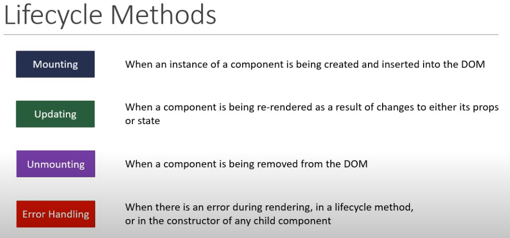
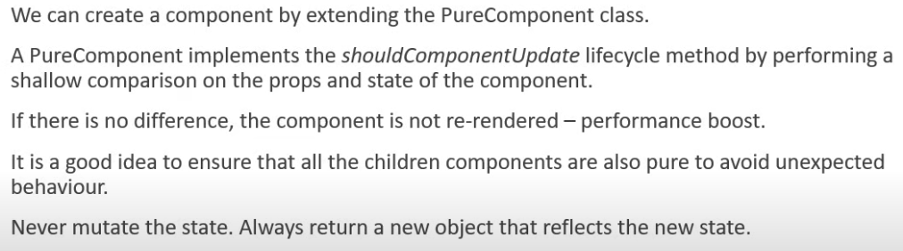
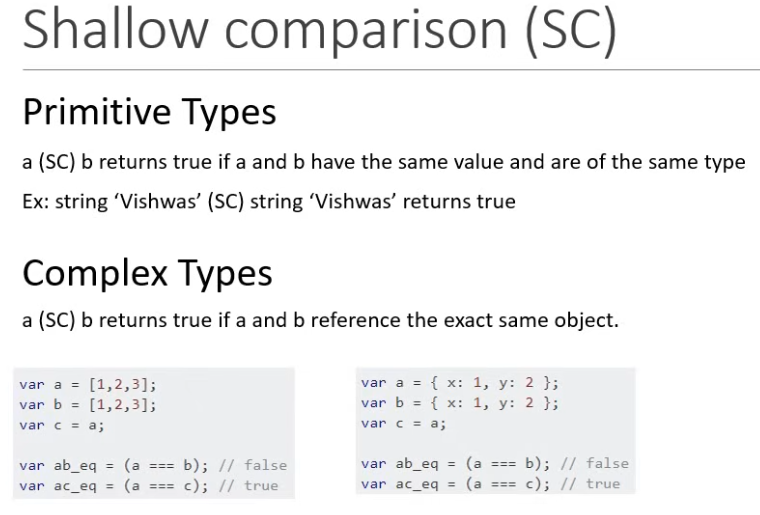
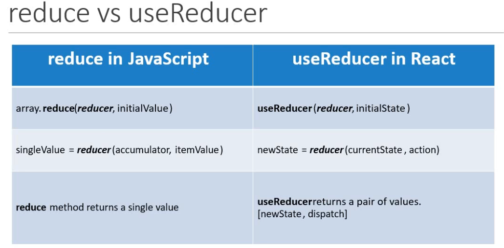

What is react
    Open source library for building user inerfaces
    not a framework
    Focus on UI
    Rich ecosystem
        Routing are all not React it is  rich user interfaces
    
    created and maintained by Facebook
    huge community

    react is a component based Architecture

    Reusable code
    react is declarative 
        tell the react what you want & It will buil the actual code.

    npx -> npm packeg ruunner directly run without nstalleing 

    npm -> install packge globally 

    React 16 =>>>>============================>++++++++++++++++
    manifest.json is for progressive web app
    building single page application

    Components -> are the building blocks of user interfaces.
                 describes a part of the user intreface
                the are  reusable and can be nested inside other components
        2 types
        state less functional components
        stateful class components

    default export can be imported as any names
    FC recievs properties and returns JSX as o/p

    JXS
         Javascript XML - extension to the Javascript language syntax
         Write XML-like code for elements and components.
         JSX tags have a tag name , attributes and children
         JSX is not a necessity to write React applications.
         JSX makes your react code simpler and elegant
         JSX ultimately tansiles to pure JavaScript which is understood by the browsers

    without JSX

    jsx differeneces

    Props
     Is just an object that contains the attributes and their values which have been passed from the parent component
     It is immutable, cannaot change the values

    State 
        An object that is privately maintained inside a component.
        Can influences what is rendered in the browser
        State can be changed within the component.

    Destructuring
        unpack vaalues from arrays or properties from objects into distinct variables.

    Event handling
        onClick    in venilla js is onclick

    if we pass onClick={clickHandler()} output is clickHandler excecuted on render before user click the button, always pass the reference onClick={clickHandler}  

    in cmponent => this keyword within the event handller is undefined 
 
    child parent communication
    pass the method itself as a prop to child comp

Conditional rendering
    if/else
    element variables
    Tenary 
    short circuit

    Jsx -> syntactic sugar for function calls & object construction

    list component key is not a prop
    key -> idenetify which item removed/added/ 

when we use index as a key there wil be problem missed order

in this diagram added new item empty to beginning but empty added to the last this is bcoz using index as key

Styling
    CSS stylesheets
    Inline styling
    CSS Modules // react-scripts should be > 2.0.0
                file name should be suffix appStyles.module.css
                classes are locally scoped by default
    CSS in JS Libraries

Basic Form

class component life cycle 

console. log of mounting phase parent LifecycleA child LifecycleB  componenet

log of updating phase

    

unmounting phase

Fragment
    group list of children elements without adding extra nodes to the DOM 
    <React.Fragment key={}>  can pass only key attribute
    <> short end but key attribute not allowed here

Pure Component
A function is said to be pure if it meets the following two conditions:
Its return value is only determined by its input values
Its return value is always the same for the same input values
shallowCompare is an efficient way to detect changes. It expects you don't mutate data.

output
    parent render
    regular comp render
    pure comp render

    parent render
    regular comp render
 functioanl component uses memo to make pure function

 but in FC useState component isn't re-rendered if it's the same value, i.e. a value that passes === comparison

 Refs
    access DOM node directly
        uses focus input
        access input text
        callback ref

Portals

It also helpes to event delegation
because modal component or backdrops should not be affected by parent component i parent component stle might be display none, when it is in root , Thats why modal component will be placed in portals

Error Boundary

try / catch is great but it only works for imperative code, However, React components are declarative and specify what should be rendered:

HOC

Pattern used to share a common functionality b/w componnet without repeating the code.
ex: redux, router in react router, styles in MUI
clickCounter -> wrapped comp / original comp
hoverCounter -> wrapped comp / original comp
withComponent -> reusable logics takes original component and produce enhanced component
pass props
pass arguamnts
refer: withComponent

Render props

Context

HTTP

Hooks

useState

    prev value used to increment five time the counter
    
    out put count 5

    useState with objects
     does not automaticaly merge & update objects manually merge it by spred operator or prev state

    <script>
        const [formValues, setFormValues] = useState({
            userId: "",
            title: "",
            body: "",
        });

        function formHandler(e) {
            setFormValues((prev) => ({ ...prev, [e.target.name]: e.target.value }));
            setFormValues({ ...formValues, [e.target.name]: e.target.value });
        }
    <script/>
    both are same

useState with array

  

useEffect hook

code repeations to avoid useEffect comes into picture

use effect runs after every render
conditionally render

comonent clean up subscription or event listners used for avoid memory leaks

tick counter example
    use [count] as dependency or prevstate to tick counter

useReducer hook

useReducer with Context

useCallback hook
used to performance optimization
    React.memo is HOC

why can use useCallback hook all the time is not good idea?
    You must strike a balance between the usage of the hook and the complexity it adds to your code. Hence, only use the hook only when you need to memoize an expensive function which needs to be passed down to children components as a prop.

When using React.StrictMode in the application, react will render twice in development mode. This is to make sure that there are no side effects. however in Production environment, it only renders once.

output

    render Title
    Count.jsx:4 render Count age
    IncrementButton.jsx:5 render age button click
    Count.jsx:4 render Count salary
    IncrementButton.jsx:5 render salary button click

when we use React.memo and useCallback hook

    render Count age
    IncrementButton.jsx:5 render button click Increment Age

useRef
can be used for this

Custom hook is simply a function that uses a hook and whatever function component calls that custom hook thats where the hook will end up attached to within the fibre tree.

