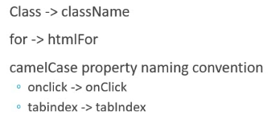

What is react
    Open source library for building user inerfaces
    not a framework
    Focus on UI
    Rich ecosystem
        Routing are all not React it is  rich user interfaces
    
    created and maintained by Facebook
    huge community

    react is a component based Architecture

    Reusable code
    react is declarative 
        tell the react what you want & It will buil the actual code.

    npx -> npm packeg ruunner directly run without nstalleing 

    npm -> install packge globally 

    React 16 =>>>>============================>++++++++++++++++
    manifest.json is for progressive web app
    building single page application

    Components -> are the building blocks of user interfaces.
                 describes a part of the user intreface
                the are  reusable and can be nested inside other components
        2 types
        state less functional components
        stateful class components

    default export can be imported as any names
    FC recievs properties and returns JSX as o/p

    JXS
         Javascript XML - extension to the Javascript language syntax
         Write XML-like code for elements and components.
         JSX tags have a tag name , attributes and children
         JSX is not a necessity to write React applications.
         JSX makes your react code simpler and elegant
         JSX ultimately tansiles to pure JavaScript which is understood by the browsers

    without JSX

    jsx differeneces

    Props
     Is just an object that contains the attributes and their values which have been passed from the parent component
     It is immutable, cannaot change the values

    State 
        An object that is privately maintained inside a component.
        Can influences what is rendered in the browser
        State can be changed within the component.

    Destructuring
        unpack vaalues from arrays or properties from objects into distinct variables.

    Event handling
        onClick    in venilla js is onclick

    if we pass onClick={clickHandler()} output is clickHandler excecuted on render before user click the button, always pass the reference onClick={clickHandler}  

    in cmponent => this keyword within the event handller is undefined 
 
    child parent communication
    pass the method itself as a prop to child comp

Conditional rendering
    if/else
    element variables
    Tenary 
    short circuit

    Jsx -> syntactic sugar for function calls & object construction

    list component key is not a prop
    key -> idenetify which item removed/added/ 

when we use index as a key there wil be problem missed order

in this diagram added new item empty to beginning but empty added to the last this is bcoz using index as key

Styling
    CSS stylesheets
    Inline styling
    CSS Modules // react-scripts should be > 2.0.0
                file name should be suffix appStyles.module.css
                classes are locally scoped by default
    CSS in JS Libraries

Basic Form

class component life cycle 

console. log of mounting phase parent LifecycleA child LifecycleB  componenet

log of updating phase

    

unmounting phase

Fragment
    group list of children elements without adding extra nodes to the DOM 
    <React.Fragment key={}>  can pass only key attribute
    <> short end but key attribute not allowed here

Pure Component
A function is said to be pure if it meets the following two conditions:
Its return value is only determined by its input values
Its return value is always the same for the same input values

output
    parent render
    regular comp render
    pure comp render

    parent render
    regular comp render
 functioanl component uses memo to make pure function

 but in FC useState component isn't re-rendered if it's the same value, i.e. a value that passes === comparison