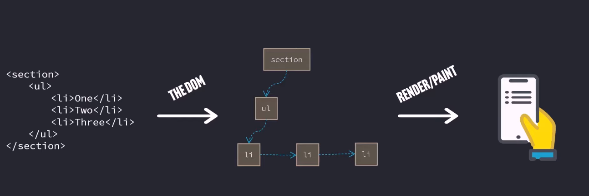

built by facebook
source code https://github.com/facebook/react
React is just other people's javascript code

-> The Dom and Declaraive programming
Document Object Model
    
     
    html being converted to DOM by bowser and serves to user view

Dom Manipulation (browser Re-rendering)
    Change the DOM tree browser gets rerenders.

docment.getelementById('') is browser API not a jS standard
setTimeout  is browser API not a jS standard