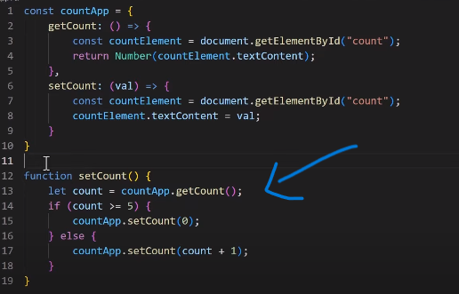

built by facebook
source code https://github.com/facebook/react
React is just other people's javascript code

-> The Dom and Declaraive programming
Document Object Model
    
     
    html being converted to DOM by bowser and serves to user view

Dom Manipulation (browser Re-rendering)
    Change the DOM tree browser gets rerenders.

docment.getelementById('') is browser API not a jS standard,
setTimeout  is browser API not a jS standard

    Imperative Programming
        A style of programming in which you describe how a program should accomplish a task. 
        ex: counter increment 
    Declarative 
        A style of programming in which you describe what you want the program to accomplish without describing how.
        ex: 
        focus only the logic
    
React used Declarative 

Recursion
    A function calling itself

